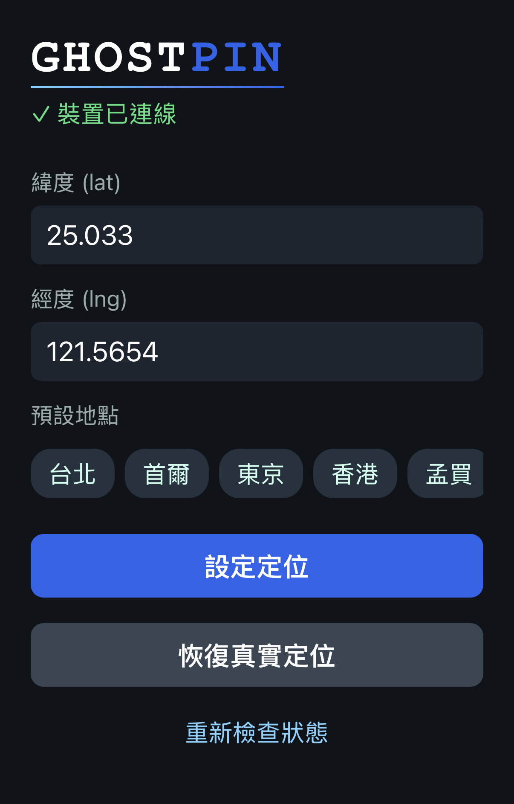

# Ghost-Pin

改變實體 iPhone 定位的介面。Expo App → Node.js Server → pymobiledevice3 → iPhone（iOS 17+）。



## Demo


## 一次性設定

1. `pipx install pymobiledevice3 --python python3.12`（Python 3.14 有 asyncio 相容問題，需指定 3.12）
2. iPhone 開 Developer Mode、USB 連 Mac、信任電腦
3. `pymobiledevice3 mounter auto-mount`
4. App Store 安裝 **Expo Go**

> tunnel 不需要事先安裝 —— `./start.sh` 啟動時會自動開（見下方），關閉時收掉。

## 啟動

**方式一：Mac App（推薦）**

直接開啟 `GhostPin.app`，控制台提供按鈕啟動／停止服務，並顯示 iOS 通道與 Expo 連線狀態。

**方式二：終端機**

```bash
./start.sh
```

自動完成：按需啟動 tunnel（**需輸入一次密碼**，tunnel 需 root；關閉時自動收掉）→ 偵測 Mac 區網 IP → 啟動 Server（:3000）→ 啟動 Expo（顯示 QR code）。

用 iPhone 相機掃 QR code，Expo Go 開啟後即可使用。

- 輸入緯度 / 經度（或點選預設地點），按「設定定位」
- 按「恢復真實定位」取消模擬

> **`Unable to run simctl` 可忽略。** Expo 偵測模擬器的警告，實機不受影響。

### 進階：讓 tunnel 永久常駐

若你想讓 tunnel 開機自動啟動、掛掉自動重啟（不用每次輸密碼），可裝成 launchd 常駐服務：

```bash
sudo ./scripts/install-tunneld.sh      # 安裝常駐
sudo ./scripts/uninstall-tunneld.sh    # 移回按需啟動
```

裝了之後 `./start.sh` 會偵測到既有 tunneld 並沿用，不再另外啟動或要密碼。

## 除錯

pymobiledevice3 執行失敗時會自動記錄到專案根目錄的 `errors.log`：

```bash
tail -f errors.log
```

---

`app/src/config.ts` 已列入 `.gitignore`；範本見 `app/src/config.example.ts`。
